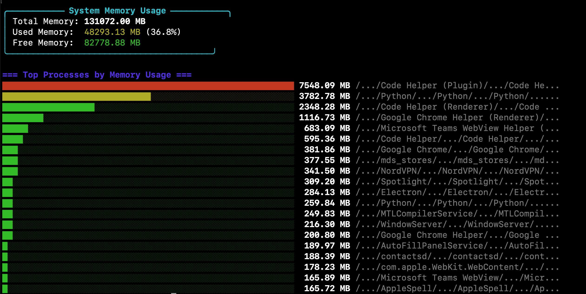

# topm

A tool to display system memory usage.



## Installation
### Quick Installation


Global Installation:
```bash
git clone https://github.com/rayking99/topm.git
cd topm
npm run topm_global
```

Local Installation:
```bash
git clone
cd topm
npm run topm_install_loc


# then in ~/.bashrc or ~/.zshrc for global usage
topm () {
    NODE_NO_WARNINGS=1 npx zx /path/to/memoryUsage.mjs
}

```


### Local Installation

Clone the repository:

```bash
git clone https://github.com/rayking99/topm.git
cd topm
```

Install dependencies:

```bash
npm install
```

Link the package globally:

```bash
npm link
```

### Global Installation

Install the package globally using npm:

```bash
npm install -g topm
```

## Usage

Run the topmem command:

```bash
topm
```

## Uninstallation

To unlink the package:

```bash
npm unlink -g topm
```